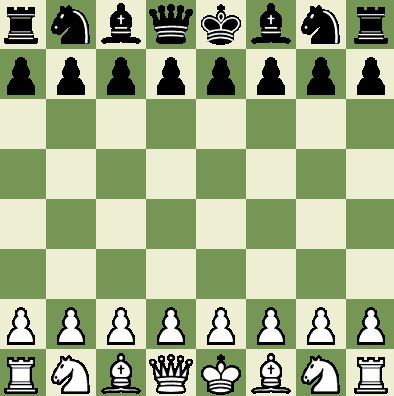
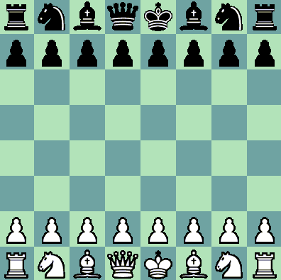
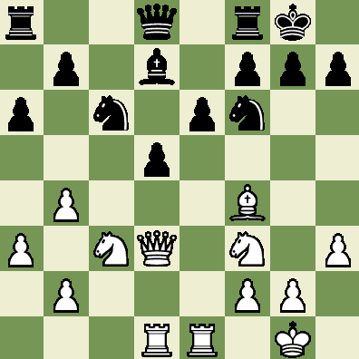

# Chess

## Introduction

Step into the world of C++ programming through this immersive chess game, offering an engaging experience with both text-based and graphical interfaces. It provides a solid foundation for exploring game mechanics, object-oriented design, and efficient use of data structures. The game supports various player configurations, delivering a fun and interactive experience while showcasing the power of C++ in implementing complex systems.

## Game Features

- **Text-Based Display**: The game is displayed in the console, showing the current board state after every move.
  
  Example:
```  
8  r n b q k b n r
7  p p p p p p p p
6    _   _   _   _
5  _   _   _   _  
4    _   _   _   _
3  _   _   _   _  
2  P P P P P P P P
1  R N B Q K B N R
```
- **Graphical Display**: A visually appealing graphical interface of the chessboard and pieces using a simple design.

  Example:
  


Different themes are available, such as the coral theme.



## Players

The game supports multiple configurations:
- **Human vs. Human**: Two players interact with the board and take turns.
- **Human vs. Computer**: One player is human, and the other is controlled by the computer.
- **Computer vs. Computer**: Two computers play each other at varying levels of difficulty.

### Computer Difficulty Levels
- **Level 1**: Random legal moves.
- **Level 2**: Prefers capturing and checking moves.
- **Level 3**: Avoids capture, prefers capturing and checking.
- **Level 4+**: More sophisticated.

## Commands

Here are the commands supported by the game:

- **game [white-player] [black-player]**: Starts a new game with the specified players. [white-player] and [black-player] can be either `human` or `computer1-4`.
- **resign**: Concedes the game to the opponent.
- **move [start] [end]**: Moves a piece from the start square to the end square (e.g., `move e2 e4`). Castling would specified by the two-square move for the king: `move e1 g1` or `move e1
c1` for white. Pawn promotion would additionally specify the piece type to which the pawn is promoted: `move e7
e8 Q`. In the case of a computer player, the command `move` (without arguments) makes the computer player make a
move.
- **setup**: Enters setup mode to manually set up the board configuration.
- **done**: Exits setup mode after ensuring the board is valid.

### Setup Mode
- `setup` enters setup mode, within which you can set up your own initial board configurations. This can only be done when a game is not currently running. Within setup mode, the following language is used:
  - `+ K e1` places the piece `K` (i.e., white king in this case) on the square `e1`. If a piece is already on that square, it is replaced. The board should be redisplayed.
  - `- e1` removes the piece from the square `e1` and then redisplays the board. If there is no piece at that square, take no action.
  - `= colour` makes it `colour`’s turn to go next (black or white).
  - `done` leaves setup mode.

The user cannot leave setup mode until the following are satisfied:
- The board contains exactly one white king and exactly one black king.
- No pawns are on the first or last row of the board.
- Neither king is in check.

Example of a successful setup board:



## Getting Started

To start up the game, you need a C++ environment that supports graphical applications. If you're using a Unix-based system, make sure you have the necessary libraries installed. For Windows users, you may need to install an X server such as XMing to run the graphical interface.

1. **Compiling the Program**: 
 To compile the project, simply run:
 ```bash
 make
```

2. **Running the Game**:
After successfully compiling the project, you can run the game with:
```bash
./chess
```
